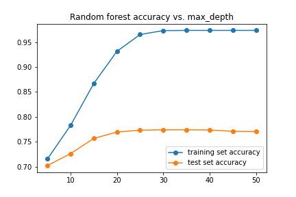

```{r, include = F}
knitr::opts_chunk$set(cache = T, message = F, warning =F)
library(tidyverse)
library(lme4)
library(pROC)
library(kableExtra)
library(performance)
library(lattice)
library(brms)
library(reshape2)
library(dplyr)
library(gridExtra)
library(cowplot)
library(arm)
library(knitr)
library(randomForest)
library(caret)
library(MASS)
```

```{r,echo = F,result ="hide"}
df <- read.csv('data/train.csv')
df2<- read.csv('data/test.csv')
```


# 1 Introduction and dataset

The project's primary focus is forecasting whether or not an Airbnb listing is available, which is a classification problem. The dataset is from Inside Airbnb Data Platform with 7471 observations and 22 variables, including hosting characteristics, room information, room type, and reviews. In addition, the dataset contains 2139 missing values. The dependent variable Decision is binary, with 1 standing for available and 0 for unavailable. The dataset is quite balanced.

# 2 Data Cleaning 

There are four groups of features in the dataset, excluding avaliability (the dependent varaible)

```{r,result ="hide",echo = F}
df <- transform(df, Decision = as.factor(Decision))
```


**Host Characteristics**: Four features are associated with host information, including Host_response_time, Host_is_superhost, Host_has_profile_pic, and Host_identity_verified. All four features are binary, with 1 for "Yes" and 0 for "No". For all features, missing values are recoded as a different group, named unknown.
```{r,result ="hide",echo = F}
df <- transform(df, Host_response_time = as.factor(Host_response_time))
```


**Room Information**: Room Information includes Price, Neighbourhood, Bathroom_text, Bedrooms, Beds, Balcony, Parking, and Cooking. Regular expressions are applied to price to remove the dollar sign in the front and the commas between numbers. In addition, the distribution of price is right-skewed; therefore, a log transformation is applied. Variable Bathroom_text is formatted as strings, containing two parts of information: the number of bathrooms and the bathroom type. Splitting the string into two the above parts is necessary. Bedrooms and Beds contain a number of missing values, but they can be imputed. The distributions of both features are right-skewed with the Pearson correlation coefficient of 0.85 approximately. Therefore I used the median value of Bedrooms to impute the missing value in Beds and vice versa. There are still some missing values remaining. One potential solution is to use the median number of bathrooms to fill because the Pearson correlation coefficient between the number of bedrooms and the number of bathrooms is 0.81 approximately.

```{r,result ="hide", echo = F}

df$Price <- as.numeric(str_replace_all(str_extract(df$Price, "\\d.*"),
                c("$" = "", " " = "", "," = "")))
df["Price"] <- log(df["Price"])


df <- df %>%
  mutate(Bathrooms_text = ifelse( grepl("half-bath", tolower(Bathrooms_text)),
                                  "0.5 bath", 
                                  Bathrooms_text))%>%

  separate(col = Bathrooms_text, into = c("Bath", "Bath_type"), sep = " ") %>%
    mutate(Bath_shared = ifelse(Bath_type == "shared", 1, 0),
           Bath_shared = as.factor(Bath_shared),
         Bath = as.numeric(Bath))

cor1 <- cor(df$Bedrooms,df$Beds,use="complete.obs")
cor2 <- cor(df$Bedrooms,df$Bath,use="complete.obs")
median1 <- median(df$Bedrooms/df$Beds, na.rm =T)
median2 <- median(df$Bedrooms/df$Bath, na.rm =T)


df <- transform(df, Neighbourhood = as.factor(Neighbourhood))


df <- df %>%
  filter(!is.na(Bedrooms) & ! is.na(Beds)) %>%
  filter(Host_response_time != "NA" & !is.na(Bedrooms)) 

df <- df %>%
  mutate(No_review = ifelse(Number_of_reviews == 0, 1, 0))
df <- transform(df,
                Instant_bookable = as.factor(Instant_bookable),
                 No_review = as.factor(No_review))
```


**Room Type**: There are 55 different property types, and the availability ratios and the sample sizes are different across all 55 groups. Some groups have extremely small sample sizes; thus, aggregating them can be a choice. Regarding 100 as the cutoff points of group sample size, property type groups with sizes greater than 100 remain the same. For other property types, if the type name contains text "private" or "entire", they can be treated as "Private small room"; if the Property_type contains the text  "shared", they can be treated as "Share small room". Otherwise, they are aggregated to group "Other".

```{r,result ="hide",echo = F}
small <- df %>%
  group_by(Property_type)%>%
  summarise(n = n()) %>%
  arrange(n) %>%
  filter(n <= 100) 

small2 <- df2 %>%
  group_by(Property_type)%>%
  summarise(n = n()) %>%
  arrange(n) %>%
  filter(n <= 100) 

small_properties <- c(small$Property_type,small2$Property_type)


df <- df %>%
  mutate(private = (grepl("private", tolower(Property_type), fixed = TRUE)|
                        grepl("entire", tolower(Property_type), fixed = TRUE)|
                        grepl("hotel", tolower(Room_type), fixed = TRUE)))

df <- df %>%
    mutate(Property_type2 = case_when(
    (Property_type%in%small_properties & grepl("private", tolower(Property_type), 
                                               fixed = TRUE)) ~ "Private small room",
    (Property_type%in%small_properties & grepl("entire", tolower(Property_type), 
                                               fixed = TRUE)) ~ "Private small room",
    (Property_type%in%small_properties & grepl("shared", tolower(Property_type), 
                                               fixed = TRUE)) ~ "Share small room",
    (!(Property_type %in% small_properties)) ~ Property_type,
    TRUE ~ "Other"))

```


**Reviews**: A dummy variable is created instead of Number_of_reviews because the overall pricing is significantly different between listings having reviews and listing without reviews.


# Methods

## Cross-validation and Evaluation Metrics

Before introducing methods, the dataset is split into two parts, self-contributed training and testing. The proportion of testing data is 0.3. 5-fold cross-validation is applied to avoid overfitting. Models are trained and tuned hyperparameters in the self-contributed training dataset and predicted in the self-contributed testing dataset. The accuracy ratio is the choice of evaluation metric because it simply measures how often the classifier correctly predicts. Since our goal is to predict the availability of Airbnb listings based on balanced data, the accuracy ratio is useful when the target class is well balanced.

## Logistic Regression

Logistic regression is easy to train and interpret, providing a general view of the pre-processing quality. In addition, there are not many parameters that need to be tuned in logistic regression, except the penalization. Penalized logistic regression imposes a penalty for having too many variables. With L2 penalty and 5-fold cross-validation inside the self-contributed training dataset to tune the penalty strength. Most often the penalty term is $\lambda \sum \theta_j ^2$, and $C = \frac{1}{\lambda}$. The choice of penalty strength C can be selected from $10^{-6}, 10^{-5},\cdots, 10^6$. Although a larger value of C lowers the strength of regularization, the purpose of the selection is to visualize the training & testing accuracy and the time. The result of the grid search suggests C = 100 ($\lambda = 0.01$) as the optimal hyperparameter. The overall accuracy is 0.70 on the training dataset and 0.69 on the testing dataset.


## Random Forest

The second method is the random forest, which uses bagging to select the subset of observation & features and uses majority vote to classify. Instead of searching for the most critical feature while splitting a node as a decision tree does, it adds additional randomness to the model, finds the best features among randomly selected subsets of features, resulting in a wide diversity. In addition, Random Forest performs well to solve non-linearity problems. And it can handle high-dimension datasets. The last important reason is that Random Forest can handle missing values and outliers. Even though there is no missing value after the pre-processing process, Random Forest is a good try. One noteworthy point is that we will get different results if we perform random forest in both R and Python. The function in sklearn.ensemble package (Python) averages the probabilistic predictions of each tree while the function in R uses the majority votes. I did in the random forest in both python and R. The parameter tuning steps are quite different; the results also have discrepancies.

**Random Forest in R**: R provides hidden one-hot encoding processing. The hyperparameters that need to be tuned are mtry (the number of features used in each tree, with candidates $8,9,\cdots, 17$), maxnodes (the maximum number of terminal nodes, with candidates $600,800,\cdots, 1400$) and ntrees (the number of trees to be fitted, with candidates $800,1000,\cdots, 1600$). These predetermined numbers are from the random testing, which shows ntress has to be greater than 800 to avoid overfitting. The grid search result shows the optimized group of hyperparameter is $mtry = 9$, $ntree = 1200$, $maxnode = 1400$, $mtry = 9$. The model performance is pretty good in my self-contributed training (accuracy rate 0.79) and testing sets (accuracy rate 0.79) with a running time of 5.1 seconds.

**Random Forest in Python**:  We need to manually use function get_dummies or label encoding before implementing the random forest function. The hyperparameters need to be tuned considered are n_estimator (the number of trees to be fitted, with candidates $800,1000,\cdots, 1600$) and max_depth (the maximum depth of a single tree, with candidates $5,10,\cdots, 50$). Even though using grid search to find the optimized pair of hyperparameters ($n_estimator = 1200$, $max_depth = 20$), the result overfits - the result exceeds the accuracy rate of 0.93 on the self-contributed training set and the accuracy rate of 0.78 on the testing set (running time 5.1 seconds). In general, the model does not have an excellent generalization performance because of overfitting. If we decrease the max_depth to 8, the overfitting reduces. The overall accuracy rates of training and testing sets are 0.77 and 0.72, with a running time is about 3.2 seconds. It raises a trade-off between accuracy and overfitting.


```{r, result ="hide",echo = F}
set.seed(123)
smp_size <- floor(0.75 * nrow(df))
train_ind <- sample(seq_len(nrow(df)), size = smp_size)
train <- df[train_ind, ]
test <- df[-train_ind, ]
```


```{r, result ="hide",echo = F}
dff <- df %>%
  dplyr::select(Decision,Neighbourhood  , Cooking, Room_type ,
                   Accommodates , Bath , Bath_shared , No_review ,
                   Price , Bedrooms , Essentials , Parking  , Property_type2 ,
                   Instant_bookable  , Beds  , Host_response_time)

write.csv(dff, "dff.csv", row.names = F, quote = F)
```

```{r,result ="hide",echo = F}
# control <- trainControl(method='repeatedcv',
#                         number=10,
#                         repeats=3,
#                         allowParallel = TRUE)
# 
# grid1 <- expand.grid(mtry = seq(from = 7, to = 11, by = 1))
# 
# 
# 
# model_rf <- train(as.factor(Decision) ~ Neighbourhood  + Cooking+ Room_type +
#                    Accommodates + Bath + Bath_shared + No_review +
#                    Price + Bedrooms + Essentials + Parking  + Property_type2 +
#                    Instant_bookable  + Beds  + Host_response_time,
#                    data = train,
#                    method = "rf",
#                      metric = "Accuracy",
#                         trControl = control,
#                 importance = TRUE,
#                tuneGrid = grid1)
# 
# 
# maxnodes <- matrix(c(600, 800, 900, 1000, 1200, 1500, 1800), ncol = 1)
# ntrees <- matrix(c(800, 1000, 1200, 1400, 1600), ncol = 1)
# grid2 <- meshgrid(maxnodes, ntrees)
# 
# grid2 <- cbind(matrix(grid2[['X']], ncol = 1), atrix(grid2[['Y']], ncol = 1, byrow = T))
# tuneGrid <- expand.grid(.mtry = 8)
# 
# 
# grid_tune2 <- mcparallel({
#   apply(grid2, 
#         MARGIN = 1,
#         FUN = function(x)
#           train(as.factor(Decision) ~ Neighbourhood  + Cooking+ Room_type +
#                    Accommodates + Bath + Bath_shared + No_review +
#                    Price + Bedrooms + Essentials + Parking  + Property_type2 +
#                    Instant_bookable  + Beds  + Host_response_time,
#         data = train,
#         method = "rf",
#         metric = "Accuracy",
#         tuneGrid = tuneGrid,
#         trControl = control,
#         importance = TRUE,
#         maxnodes = x[1],
#         ntree = x[2]))
#     })
# 
# mccollect(grid_tune2)
```


## AdaBoost

AdaBoost is one of the first boosting algorithms adapted to solving practices. It combines the performance of any machine learning algorithm (especially some weak learners) into a single robust classifier by giving more weight to the previous classification's misclassified examples. In this case, the decision tree is the choice of a weak learner. Two hyperparameters need to be tuned in AdaBoost: the learning rate (candidates $0.1,0.2,\cdots,1.0$) and the number of trees (candidates $100,200,\cdots,1200$). $learning_rate = 0.1$ and $n_estimator = 1000$ are the optimal pairs of hyper-parameters from grid search with a training accuracy 0.74 and a testing accuracy 0.71. There is not much difference between the training and testing accuracy, but the model still overfits a little. The running time is about 3.6 seconds when using the optimal pair of hyperparameters.
# Results
## Prediction

```{r,echo = F}

methods <- c("Logistic Regression", "Random Forest in R", 
             "Random Forest in Python (overfitting)",
          "Random Forest in Python (not overfitting)", "Adaboost")

train_accuracy <- c( 0.70, 0.79 ,0.93, 0.77, 0.74)

test_accurcy<- c(0.69, 0.79, 0.78, 0.72, 0.71)

running_time <- c(1.2, 5.6 , 5.1, 3.2 ,3.6)

table2 <- as.data.frame(cbind( methods,train_accuracy,test_accurcy,running_time))

rownames(table2) <- methods
table2 <- table2[,-1 ]
colnames(table2) <- c("Training Accuracy", "Testing Accuracy", "Running Time (sec)")
kable(table2) %>%
    kable_styling(latex_options = c("HOLD_position","striped"))
```

Above is the accuracy of my self-contributed training and testing dataset and the running time. Random forest performed in R has the highest testing accuracy score among all three methods. Although the model takes the longest running time, the reason may be the random forest has an extra step of making dummy variables in R. In addition, the generalization performance is excellent. If we visualize feature importance in Random Forest (appendix), the top 5 essential features are Price, Neighbourhood, Host_response_time, Property_type, and Cooking. It is pretty reasonable in the real world: the price is equivalent to quality and a listing space. The Neighbourhood shows the location of housing. Usually, location is an indicator of whether the district is safe or not. The above two features are people care most when booking a room on Airbnb. In addition, Host_response_time shows the service quality, and Property_type is related to privacy.


## Future Improvement

If we split the dataset into training and testing, property types in the testing dataset may differ from the property types in the training dataset. In an extreme case, some property types that never show in the training process may occur in testing data. We need to do a suitable preprocessing to avoid level differences in prediction. In addition, different kinds of preprocessing are tried for this project, including using price per person and discretizing rating and pricing. Additional methods including KNN, Hierarchical model, and SVM are also tested to increase the testing accuracy while maintaining the generalization performance


# Citations

J. Brownlee, Boosting and AdaBoost for Machine Learning, April 25, 2016.

N. Donges, A Complete Guide to the Random Forest Algorithm, July 22, 2021.

Scikit-learn: Machine Learning in Python, Pedregosa et al., JMLR 12.

\newpage

# Appendix

```{r, echo=FALSE, out.height="30%",fig.cap="Plots of Logistic Regression",fig.show='hold',fig.align='center'}
knitr::include_graphics(c("figures/lr1.png","figures/lr2.png"))
```

```{r, echo=FALSE, out.height="30%",fig.cap="Plots of Random Forest",fig.show='hold',fig.align='center'}


```

```{r, echo = FALSE, fig.height = 6,fig.width = 7,fig.align='center'}
model_rf <- randomForest(as.factor(Decision) ~ Neighbourhood  + Cooking + 
                           Room_type + Accommodates + Bath + 
                           Bath_shared + No_review +
                   Price + Bedrooms + Essentials + Parking  + Property_type2 +
                   Instant_bookable  + Beds  + Host_response_time,
                   data = train,
                   ntree = 1200,
                   maxnode = 1500,
                   mtry = 9, importance = T)

varImpPlot(model_rf,type =2)
```